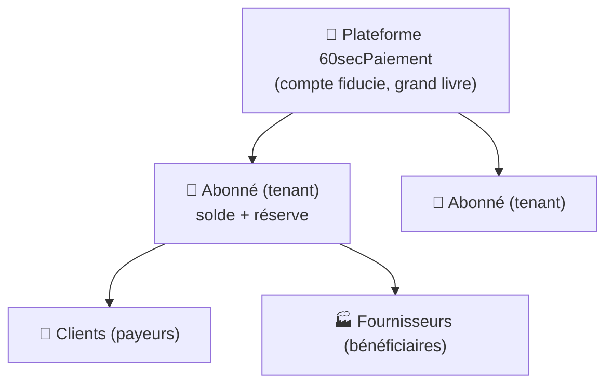
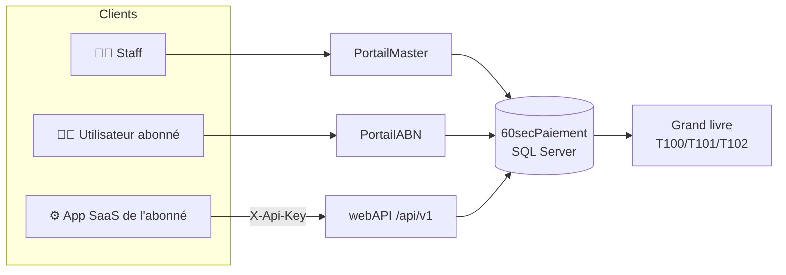
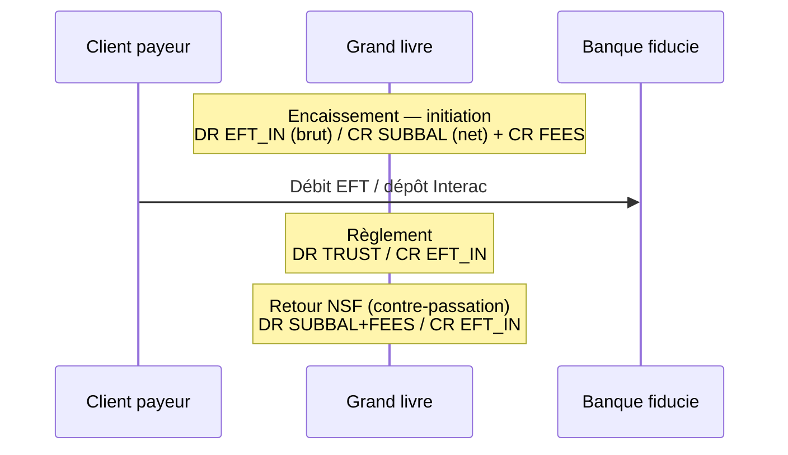
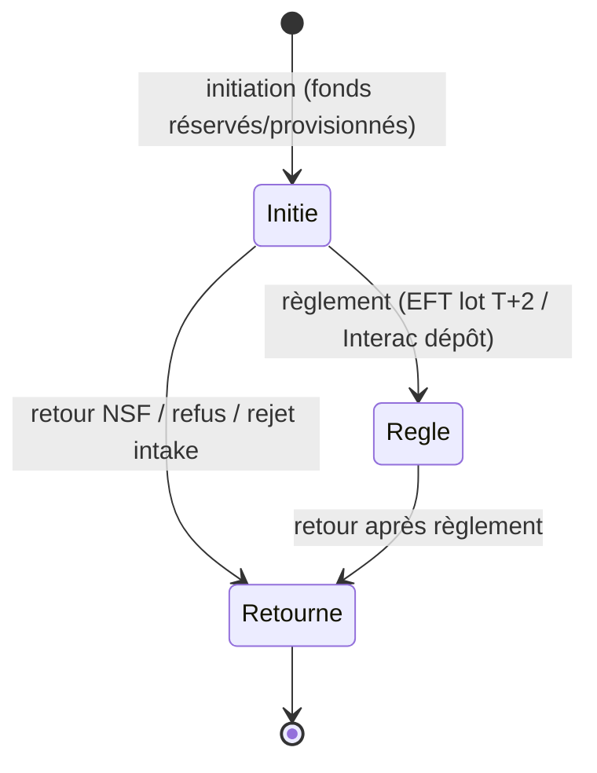
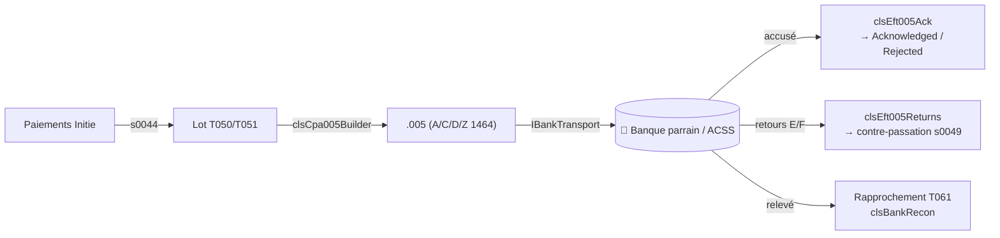
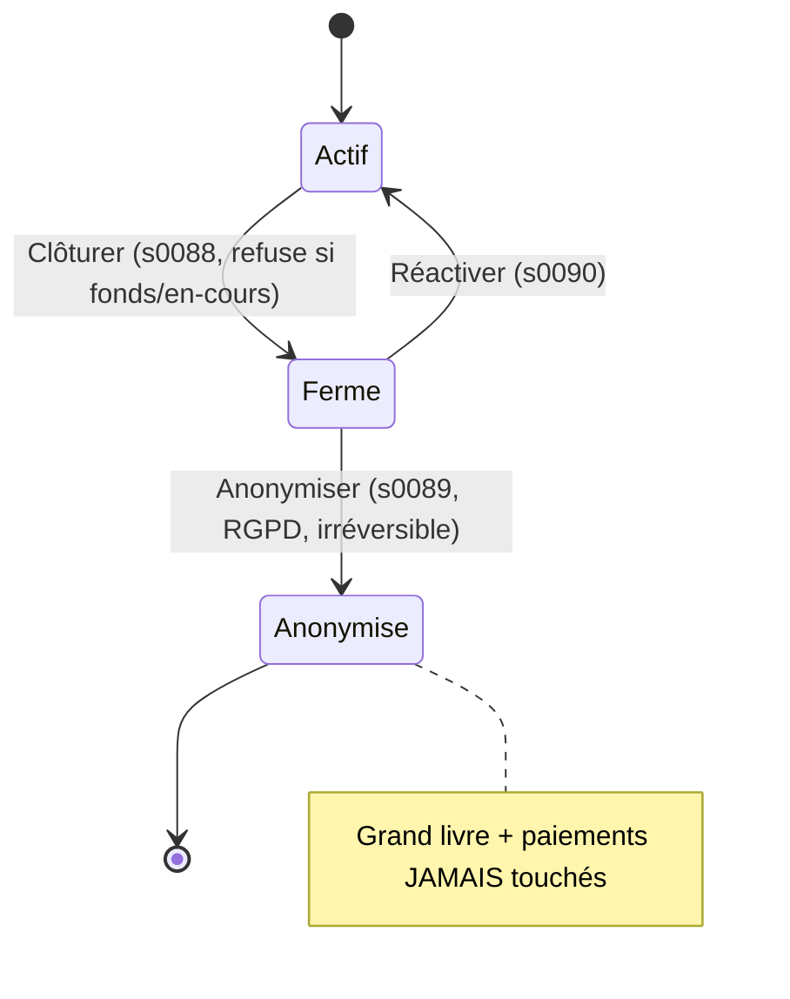

# 60secPaiement — Architecture

Infrastructure de paiement **« Fintech-as-a-Service »** (type VoPay/Stripe) au Canada :
offrir l'EFT (débits/crédits CPA-005) et l'Interac e-Transfer **via API et portails**
à des entreprises abonnées, avec grand livre en partie double, conformité et audit.

> **Statut** : plateforme largement bâtie et testée en **mode simulé/sandbox** derrière des
> connecteurs abstraits. Les rails réels (ACSS via parrain bancaire, API Interac, fournisseur
> KYB) sont **gatés par la signature des contrats tiers** ; tout le logiciel autour est prêt.

---

## 1. Vision et hiérarchie à 3 niveaux



- **Plateforme** : détient le **compte fiducie** (mutualisé, miroir de la banque) et le grand livre.
- **Abonné (locataire / tenant)** : entreprise cliente ; **détient un solde** sur la plateforme.
  Consomme le service via l'API et/ou le portail libre-service.
- **Clients (payeurs)** et **Fournisseurs (bénéficiaires)** : contreparties **externes** de
  l'abonné (pas de solde chez nous). Chaque abonné a les siens (isolation `AbonneId`).

**Réglementaire** (Canada/Québec) : FINTRAC (MSB), permis AMF, inscription PSP RPAA à la
Banque du Canada, programme AML/KYB, et un **partenaire bancaire parrain** (membre Paiements
Canada) pour accéder à l'ACSS. Non traité en logiciel — à monter avec conseil juridique.

---

## 2. Les trois sous-projets

| Sous-projet | Rôle | Utilisateurs | Stack |
|---|---|---|---|
| **PortailMaster** | Console **staff** de la plateforme : gestion des abonnés, grand livre, EFT, Interac, KYB, audit, offboarding | Personnel 60secPaiement | ASP.NET WebForms VB.NET 4.7.2 |
| **PortailABN** | Portail **libre-service des abonnés** : gérer son compte (clients/fournisseurs, encaissements/décaissements, clés API, webhooks, utilisateurs) | Abonnés | WebForms VB.NET (app distincte, port 56540) |
| **webAPI** | **API REST** consommée par les applications SaaS des abonnés | Machines (apps abonnés) | ASP.NET handlers + Newtonsoft |

Tous partagent la **même base `60secPaiement`** (SQL Server, `192.168.0.203`) via le login
applicatif `MngConsul`, et **le même grand livre**.



---

## 3. Conventions techniques (transverses)

- **Accès BD par procédures stockées uniquement** (`sNNNN`), via `clsData.ExecuteSQL/ExecuteSQLds`.
  Aucune requête SQL en ligne. Numérotation propre à cette base ; **plage libre : s0104+**.
- **Tables** préfixées `T0NN` (métier) et `T1NN` (grand livre).
- **Montants en cents entiers** (`BIGINT`), jamais de flottant. Devise CAD.
- **Mots de passe** hachés **BCrypt**.
- Fichiers `.aspx/.vb/.sql/.Master/.ashx` en **UTF-8 BOM** (sinon accents corrompus).
- Scripts DB numérotés `Database/01..41_*.sql` (séquence de migrations unique, dans PortailMaster/Database).
- **Isolation multi-locataire** : tout est scopé par `AbonneId` (les procs l'exigent ; les
  portails/API le posent depuis la session/clé API).

---

## 4. Cœur comptable — grand livre en partie double

Le grand livre est **immuable (append-only)** : triggers `INSTEAD OF UPDATE/DELETE` sur
`T101`/`T102` refusent toute modification (contre-passer, jamais corriger).

| Table | Rôle |
|---|---|
| `T100LedgerAccount` | Plan comptable. `AbonneId NULL` = compte plateforme mutualisé. |
| `T101LedgerTransaction` | Écritures (en-tête), clé d'idempotence unique. |
| `T102LedgerPosting` | Lignes (débit **ou** crédit ≥ 0), Σ = 0 par écriture. |

**Comptes** — plateforme : `TRUST` (fiducie/banque), `FEES` (produits), `SUSPENSE`.
Par abonné : `SUBBAL` (solde), `RESERVE`, `EFT_IN`/`EFT_OUT` (clearing entrant/sortant).

**Invariant vérifié** (`s0018GetPlatformSummary`) :

```
TRUST = Σ SUBBAL + Σ RESERVE + FEES + (clearing EFT_IN/EFT_OUT)
```



Un **décaissement** est le miroir : réserve `DR SUBBAL / CR EFT_OUT` puis règlement
`DR EFT_OUT / CR TRUST`. L'invariant reste équilibré à chaque étape.

---

## 5. Flux de paiement et cycle de vie

`T030Payment` porte le cycle à états, indépendamment du rail :



- **Direction** : `Entrant` (encaissement) / `Sortant` (décaissement).
- **Method** : `EFT` (défaut) / `Interac`.
- Colonnes clés : `AmountCents`, `FeeCents`, `NetCents` (calculée), liens
  `InitiationTxnId`/`SettlementTxnId`/`ReturnTxnId` vers le grand livre, `BatchId` (EFT),
  `InteracEmail` (Interac), `IdempotencyKey`.

---

## 6. Rails de paiement

### 6.1 EFT — CPA Norme 005 (AFT)



- **Génération** : `clsCpa005Builder` produit les enregistrements largeur fixe 1464
  (A/C/D/Z, dates juliennes). `T052EftOriginator` = config émetteur. `EftFile.ashx` télécharge.
- **Échange fichiers** : `clsBankExchange` (interface **`IBankTransport`** → `LocalFolderTransport`
  ou `SftpTransport` WinSCP), journal `T054FileExchangeLog`, handler `BankExchange.ashx`.
- **Accusé de réception** (`clsEft005Ack`, `T055EftAck`) : la banque confirme l'acceptation du
  fichier ; les items rejetés à l'intake sont contre-passés. États lot : Open → Generated →
  Submitted → **Acknowledged** / **Rejected** → Settled.
- **Retours / NSF** (`clsEft005Returns`, `T053EftReturn`) : enregistrements E/F rapprochés par
  référence croisée `P<id>`, contre-passés (`s0049ProcessReturn`, 4 cas Entrant/Sortant × Initié/Réglé).
- **Rapprochement bancaire** (`clsBankRecon`, `T061BankStatementLine`) : confronte le compte
  `TRUST` au relevé, écart livre ↔ banque.

> ⚠️ Positions exactes du 005 et formats d'accusé/retour = **gabarits** à valider avec le guide
> de la banque parrain. Le règlement est **simulé** (timer) tant que le parrain n'est pas branché.

### 6.2 Interac e-Transfer

Rail **parallèle**, quasi-instantané, réutilisant la même machinerie (`Method='Interac'`),
avec règlement **individuel** (pas de lot) et contrepartie par **courriel**.

- `clsInterac` : `CreateEncaissement`/`CreatePayout` (via s0020/s0038 + `Method='Interac'`),
  `Deposit` (règlement individuel `s0097`), `Decline` (contre-passation `s0049`).
- `T056InteracEvent` : journal Requested/Sent/Deposited/Declined.
- Console staff `wbfInterac.aspx?abonneId=N`. Cycle : Envoyé → Déposé / Refusé.

---

## 7. Connecteurs externes (abstraction + sandbox)

Chaque intégration tierce suit le même patron : **interface abstraite + implémentation sandbox
simulée**, prête à recevoir le vrai fournisseur quand le contrat le débloque.

| Connecteur | Abstraction | Sandbox actuel | Gaté par |
|---|---|---|---|
| Transport fichiers banque | `IBankTransport` | dossiers locaux / WinSCP | SFTP banque |
| Règlement EFT / accusés / retours | `clsCpa005Builder` + `clsEft005Ack/Returns` | fichiers + timer simulés | parrain bancaire (ACSS) |
| Interac | `clsInterac` | dépôt/refus simulés | partenaire Interac |
| KYB | `IKybProvider` | `SandboxKybProvider` (règles déterministes) | Trulioo/Onfido |
| Vérif. compte bancaire | Plaid (dans 60Sec-AI) | sandbox | — |

**KYB** (`clsKyb`, `T057KybCheck`) : `RunCheck` rassemble les données de l'abonné, appelle le
fournisseur (`Kyb.Provider` en config), enregistre le résultat (registre / sanctions / adresse
+ score), **pilote le `StatutKYB`** (Verified→Vérifié, Rejected→Rejeté, Review→En cours) et
journalise (`KybCheck`).

---

## 8. Webhooks

Notifie l'application de l'abonné (POST HTTP signé **HMAC-SHA256**) des évènements de paiement.

- `T041WebhookEndpoint` (1 endpoint URL+secret par abonné), `T042WebhookDelivery` (file :
  Pending/Delivered/Failed/Abandoned, backoff exponentiel).
- **Enqueue par trigger** `TR_T030_Webhook` sur `T030Payment` : `payment.initiated/settled/returned`
  et `payout.initiated/settled/returned` (direction-aware).
- **Dispatcher** `clsWebhookDispatcher` + `WebhookDispatcher.ashx` (en-tête `X-Dispatch-Secret`,
  pour planificateur). Config via API (`/api/v1/webhook`) ou portails.

---

## 9. API REST (webAPI)

- Base **`/api/v1`** (fallback `/api` déprécié, en-tête `X-Api-Version`).
- **Auth** : clé d'API `X-Api-Key` (hash SHA-256, `T040ApiKey` → `s0027ResolveApiKey` → AbonneId).
- **Endpoints** : `balance`, `clients`, `fournisseurs`, `payments` (entrant), `payouts` (sortant),
  `webhook` (+ `deliveries`) — réutilisent les procs scopées.
- **Pagination** (`limit`/`offset`), **rate-limiting** par clé (429, en-têtes `X-RateLimit-*`).
- **Doc** : `openapi.json` (OpenAPI 3.0) + console `docs.html` autonome (sans CDN).

---

## 10. Sécurité, isolation et conformité

### Authentification
- **Staff** (PortailMaster) : session + BCrypt (`T001PortalAdmin`), verrouillage après échecs.
- **Abonnés** (PortailABN) : session + BCrypt (`T011AbonneUser`), rôle `IsAdmin`, gestion
  multi-utilisateurs par l'abonné, **« Se souvenir de moi »** (split-token `T012`, rotation,
  restauré dans `Global.asax`).

### Isolation multi-locataire
Toutes les procs scopées `AbonneId` ; portails/API le posent depuis la session/clé. Gardes
d'appartenance à l'édition (un abonné/staff ne voit jamais les données d'un autre tenant).

### Journal d'audit — `T070AuditLog` (append-only, immuable)
Trace des actions sensibles : `Login`/`LoginFailed`/`Logout`, `ApiKeyCreate`/`ApiKeyRevoke`,
`KybCheck`, `KybStatusChange`, `Export`, `Offboard`/`Reactivate`/`Anonymize`, `AuditExport`.
Vue par-abonné (fiche) + page globale super-admin `wbfAudit.aspx` + **export CSV** (lui-même audité).

### Gouvernance des données d'un tenant



- **Clôture gardée** (`s0088`) : refuse tant qu'il reste des fonds ou des paiements en cours ;
  désactive accès + gèle contreparties. Le menu Statut ne peut plus court-circuiter ce flux.
- **Réactivation** (`s0090`) : refusée si anonymisé.
- **Anonymisation RGPD** (`s0089`) : scrub des PII (T010/T011/T020/T021/T041 + snapshots T051) ;
  **le grand livre immuable et les paiements sont conservés** (piste d'audit financière).
- **Export / portabilité** (`AbonneExport.ashx`, RGPD art. 20) : JSON de toutes les données de
  l'abonné, **sans secrets**.

### Production
`Web.Release.config` (HSTS, cookies Secure, customErrors, redirection HTTPS), rôle BD
`db_apiexec` (moindre privilège), checklist `INFRA_PRODUCTION_HARDENING.md`.

---

## 11. Automatisation (tâches planifiées)

`AUTOMATION.md` détaille 4 tâches (SQL Server Agent **ou** `scheduler.ps1`) :

| Tâche | Fréquence | Mécanisme |
|---|---|---|
| Dispatch webhooks | 1–5 min | `WebhookDispatcher.ashx` (POST signé) |
| Règlement des échéances | 1×/j | `s0056RunDailySettlement` (SIMULÉ) |
| Génération lot EFT | 1×/j | `s0057AutoGenerateBatch` |
| **Maintenance / hygiène** | 1×/j (03h) | `s0079RunDailyMaintenance` (orchestrateur) |

L'orchestrateur d'hygiène purge, avec rétention adaptée et garde-fous d'intégrité : jetons
remember-me, livraisons webhooks livrées/abandonnées, lignes de relevé rapprochées (horizon
anti-résurgence), lots EFT réglés, journaux d'échange, retours EFT traités, paiements retournés
(7 ans), utilisateurs abonnés désactivés (RGPD). Le **grand livre** et le **journal d'audit**
ne sont **jamais** purgés.

---

## 12. Catalogue des tables

| Domaine | Tables |
|---|---|
| Staff / abonnés / users | `T001PortalAdmin`, `T010Abonne` (+ClosedUtc/AnonymizedUtc), `T011AbonneUser`, `T012AbonneRememberToken` |
| Contreparties | `T020Client`, `T021Fournisseur` (coords bancaires) |
| Paiements | `T030Payment` (Method, Direction, InteracEmail, BatchId) |
| API / webhooks | `T040ApiKey`, `T041WebhookEndpoint`, `T042WebhookDelivery` |
| EFT | `T050EftBatch`, `T051EftBatchItem`, `T052EftOriginator`, `T053EftReturn`, `T054FileExchangeLog`, `T055EftAck` |
| Interac | `T056InteracEvent` |
| KYB | `T057KybCheck` |
| Rapprochement | `T061BankStatementLine` |
| Audit | `T070AuditLog` (immuable) |
| **Grand livre** | `T100LedgerAccount`, `T101LedgerTransaction`, `T102LedgerPosting` (immuable) |

---

## 13. Ce qui reste avant un pilote réel

Tout le logiciel est bâti, testé (rollback + end-to-end) et audité. Les éléments restants sont
**contractuels / tiers**, non logiciels :

1. **Partenaire bancaire parrain** : accès ACSS, formats 005/accusés/retours certifiés,
   règlement piloté par la banque (remplacer le timer `s0056`).
2. **API Interac** certifiée (via le partenaire).
3. **Fournisseur KYB** réel (Trulioo/Onfido) : implémenter `IKybProvider`, brancher `Kyb.Provider`.
4. **Réglementaire** : FINTRAC, AMF, RPAA, programme AML/KYB (juridique + conformité).

Voir aussi : `AUTOMATION.md`, `INFRA_PRODUCTION_HARDENING.md`.
